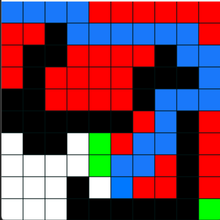

# Pathfinding Pacman

## Table of contents
1. [Inspiration](#Inspiration)
2. [Explanation](#Explanation)
    1. [PathFinding](#pathfinding)
    2. [PathPlanning](#pathplanning)
3. [Installation](#Installation)
4. [Modulation](#Modulation)

## Inspiration
This was my first-semester project for my advanced topics and projects class. 
This project was inspired by automatic maze solvers and my constant need to play Pacman when bored!

The main difference between this and a normal Pacman game is the movement of the ghosts. In normal Pacman games, the ghosts move based on a distance heuristic, meaning that each ghost moves in the direction of the Pacman based on how far they are from the Pacman. For example, if the Ghost is 15 or more tiles away from the Pacman on the X-axis then the Ghost would prioritize movement in the x-axis towards the Pacman.

While this method is good, there are a couple problems. 
1. The ghosts often use a very inefficient path
2. The ghosts also often stack on top of each other

To fix this I decided to add 2 things to the regular pacman game.
1. Implement Path finding
2. Implement Path planning

## Explanation
### PathFinding
Path Finding is a computational method by which one can find the shortest route between 2 points. There are many Path Finidng algorthims that use different methods to compute the shortest path, but the one I used is called A-Star(A*). Lets imagine a grid of 10 by 10 nodes, each node is connected to its adjacent nodes in the vertical, and horizontal axis, lets take our goal to be (10, 10) and our start to be (1, 1). The algorithim then starts a pattern of calculating the F's of its adjacent nodes. F is a value based on G and H. G being the total moves taken up until now, and H being a heuristic of the euclidian distance between the current point and the goal point. After calculating the F's for all adjacent nodes it moves to the smallest F and the pattern repeats. This process continues until our path reaches (10, 10) after which point our nodes will traceback to their previous node and these nodes will all be listed as the path. After adding walls, the calculation of H still remains the same, but the wall nodes are declared inaccessible.

### PathPlanning

## Installation

## Modulation